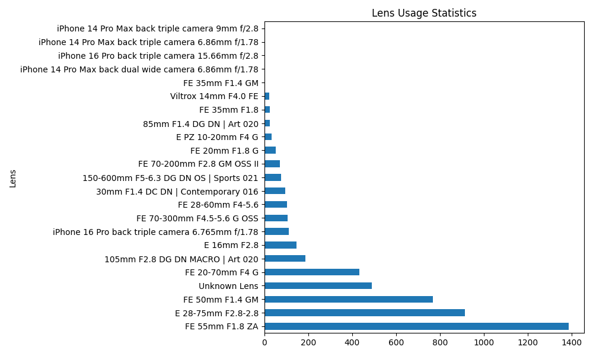
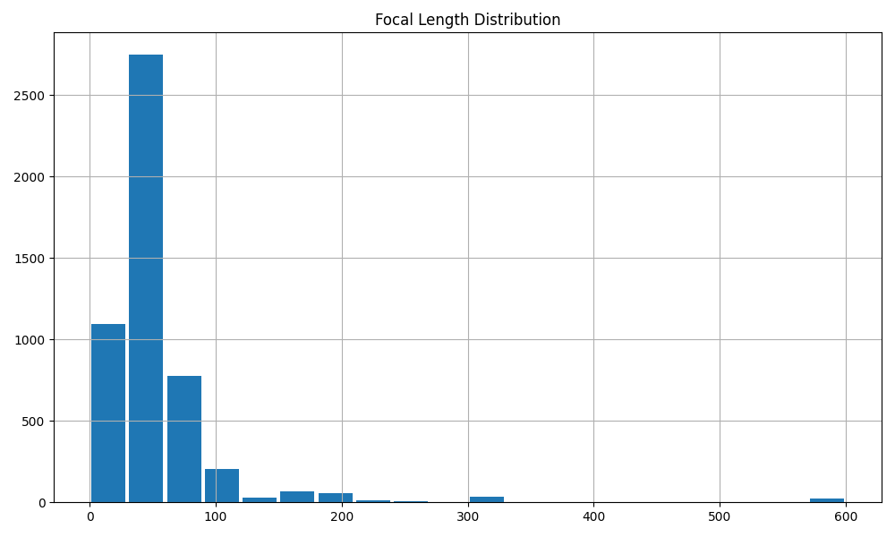
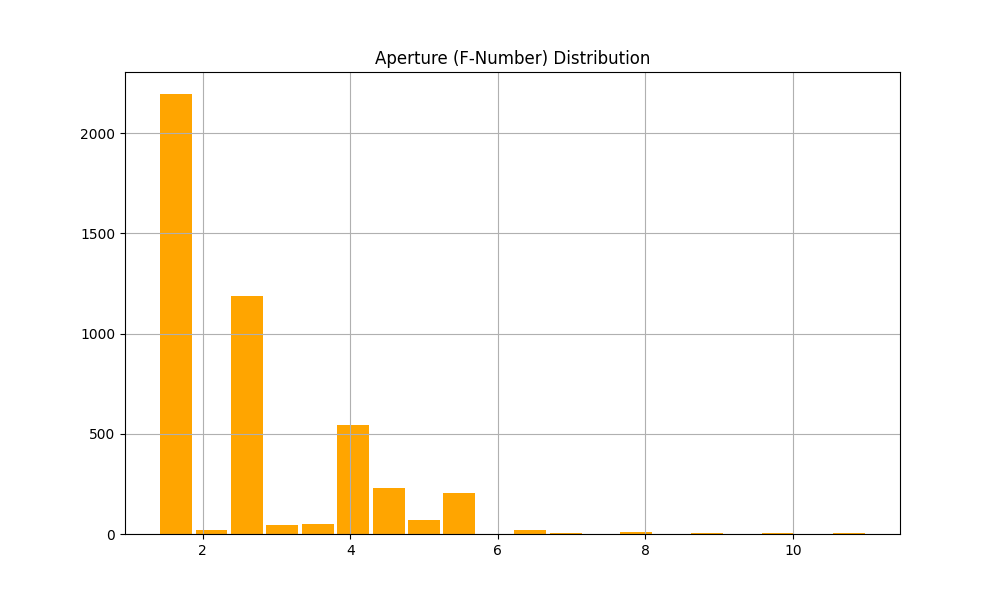
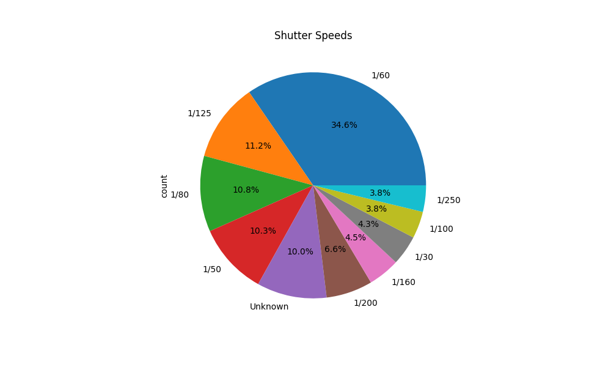
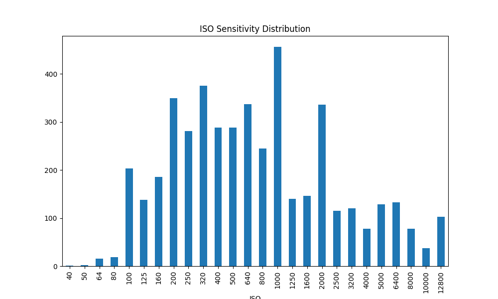

# Lens & Photo Stats Analyzer

Pythonを使用した、画像ファイルのEXIF情報解析ツールです。

大量のJPGやRAW（Sony .ARW等）ファイルからレンズ使用頻度、焦点距離、絞り、ISO、シャッタースピードを抽出し、統計グラフとCSVを出力します。

## 特徴

- **頻度分布のグラフ出力**:
  - レンズの使用頻度
  - 焦点距離の分布
  - 絞り値（F値）の分布
  - シャッタースピードの傾向
  - ISO感度の分布
- **CSV出力**: 解析結果をExcel等で編集可能な`CSV形式で保存
- **高速解析**: `ProcessPoolExecutor`による並列処理で高速に解析可能（外部ディスクの場合はアクセス時間に依存する）

## 出力イメージ

| レンズ使用頻度 | 焦点距離分布 | 絞り値（F値）の分布 | シャッタースピードの傾向 | ISO感度の分布 |
|:---:|:---:|:---:|:---:|:---:|
|  |  |  |  |  |

## セットアップ

### 必要条件
- Python 3.8以上
- Mac (M1/M2/M3/M4 Apple Silicon推奨) or Windows/Linux

### インストール
```bash
pip install exifread pandas matplotlib
```

## 使い方
ターミナルから、解析したい画像が入っているディレクトリを指定して実行します。

```bash
python main.py /path/to/your/photos --output ./my_analysis
```

### 引数オプション

- `target_dir`: 解析対象のフォルダ（必須）
- `--output` / `-o`: 結果の保存先フォルダ（デフォルト: `outputs`）

## 技術スタック

- Language: Python
- Libraries: `exifread` (EXIF解析), `pandas` (データ処理), `matplotlib` (グラフ描画)
- Concurrency: `concurrent.futures` (並列処理)
